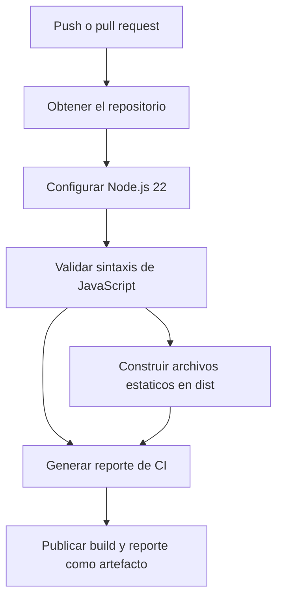

# Aplicación CRUD con JavaScript y LocalStorage

Aplicación CRUD (crear, consultar, actualizar y eliminar) construida con **HTML, CSS y JavaScript puro**. Guarda los datos en `localStorage` del navegador, por lo que no requiere un servidor ni bibliotecas externas.

## Funcionalidades

- Crear registros.
- Mostrar los registros en una tabla.
- Editar registros existentes.
- Eliminar registros.
- Conservar los datos en `localStorage`.
- Interfaz adaptable a distintos tamaños de pantalla.

## Tecnologías

- **HTML5:** estructura de la aplicación.
- **CSS3:** estilos y diseño adaptable.
- **JavaScript:** lógica y manipulación del DOM.
- **LocalStorage API:** almacenamiento local en el navegador.

## Estructura del proyecto

```text
.
├── .github/workflows/ci.yml
├── scripts/build.js
├── .gitignore
├── CRUD.html
├── script.js
├── style.css
└── package.json
```

## Integración continua

GitHub Actions ejecuta el flujo en cada envío de cambios (`push`) y pull request. El pipeline comprueba la sintaxis de JavaScript, prepara los archivos estáticos en `dist/`, agrega un reporte al resumen de la ejecución y publica el sitio generado y el reporte como un artefacto.

El proyecto todavía no cuenta con pruebas automatizadas de comportamiento. Para repetir localmente las validaciones y construir el sitio, ejecuta:

```bash
npm run check
npm run build
```



## Historial de cambios

- **Seguridad:** los nombres guardados se representan como texto para evitar que contenido HTML se ejecute al mostrar los registros.
- **Formulario:** el guardado se gestiona desde el evento `submit`, por lo que funciona al pulsar el botón o al enviar el formulario con Enter.

