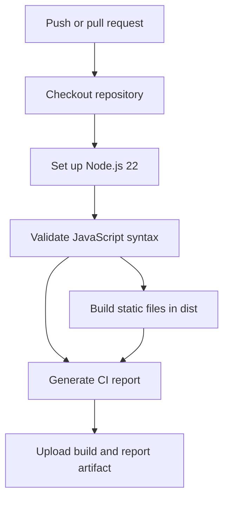

# Vanilla JavaScript CRUD App (LocalStorage)

A simple yet well-structured CRUD (Create, Read, Update, Delete) application built using **pure HTML, CSS, and JavaScript**.  
The app stores data in the browser’s **localStorage**, allowing persistence without any backend or external libraries.

This project focuses on **core JavaScript fundamentals**, clean UI design, and proper state management.

---

## 🚀 Features

- Create new records
- Display stored records in a table
- Edit existing entries
- Delete records
- Data persistence using `localStorage`
- Responsive and modern UI
- No frameworks, no libraries, no shortcuts

---

## 🛠️ Tech Stack

- **HTML5** – Structure  
- **CSS3** – Styling & layout  
- **JavaScript (Vanilla)** – Logic & DOM manipulation  
- **LocalStorage API** – Client-side persistence  

---

## 📂 Project Structure

```text
.
├── .github/workflows/ci.yml
├── scripts/build.js
├── CRUD.html
├── script.js
├── style.css
└── package.json
```

## Continuous Integration

GitHub Actions runs on every push and pull request. The workflow checks JavaScript syntax, assembles the static site in `dist/`, adds an execution report to the Actions summary, and uploads the build and report as an artifact. This project has no automated behavior tests yet.

Run the same checks locally with `npm run check` and create the static build with `npm run build`.



